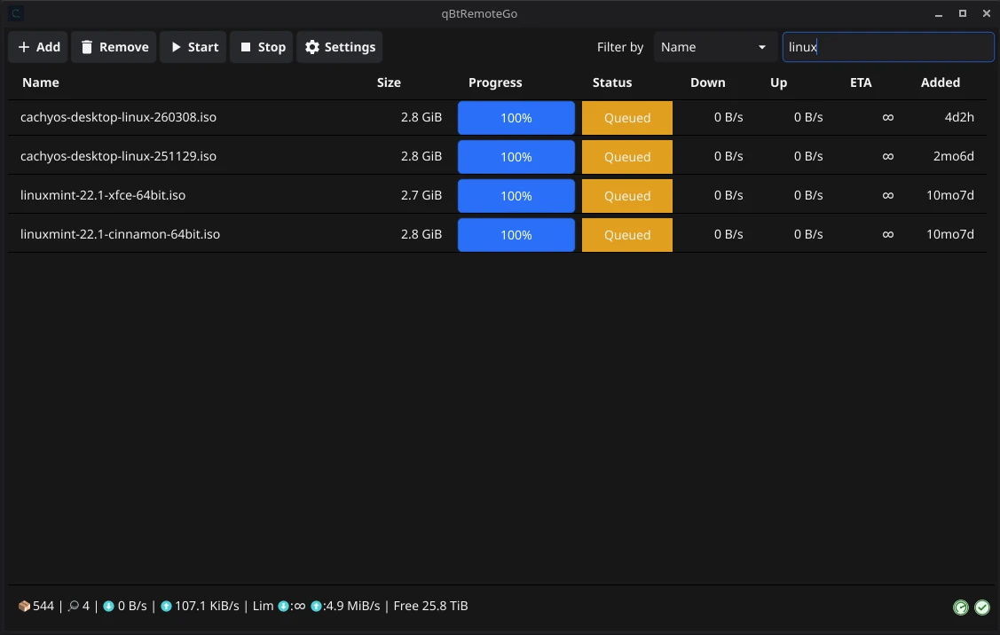
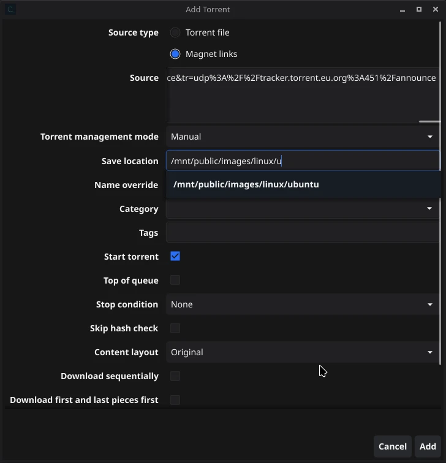

# qBtRemoteGo 

qBtRemoteGo is a native desktop client for remotely controlling qBittorrent through its Web API.

It focuses on a fast add-and-monitor workflow for magnets and `.torrent` files, with a compact GUI and desktop integration.

## Screenshots

Add torrent

## Installation

Check the [Releases](https://git.skobk.in/skobkin/qBtRemoteGo/releases) section for the latest downloads.

> [!NOTE]
> Releases are hosted on my private [Forgejo](https://en.wikipedia.org/wiki/Forgejo) instance.

## Connection & authentication

Two authentication methods, selected in *Settings → Connection*:

- **Username & password** — works with any qBittorrent version.
- **API key** — qBittorrent v5.2.0+; generate it in qBittorrent (*Preferences → WebUI → API Key*)
  and paste it here. Sent as `Authorization: Bearer`, so it can't be combined with reverse-proxy
  HTTP Basic Auth.

The app never revokes or rotates the key server-side. Only the active method's credentials are
kept — switching methods means re-entering them. Passwords and keys are stored in the system
keychain (default), in the plain-text config file, or for the current session only.

